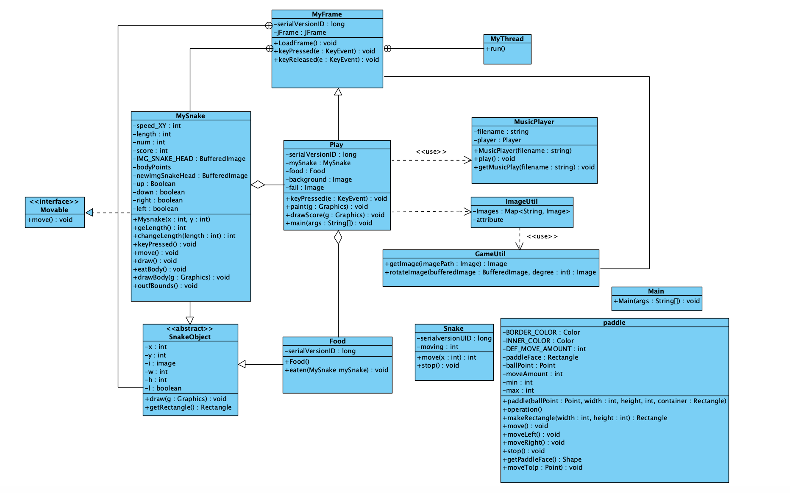

# Snake Game

----
When the code was first given to us I spent some time trying to understand the functionality of the different classes
and the methods within the classes. 
After this I decided on the diagrams that I should do : 

## UML Diagram

----
I have chosen to do an activity diagram as I felt that this would best reflect the flow of code 

## The initial Class diagram

This image shows all the classes of the code and all the relationships between them.

NOTES : As seen above in the diagram there are some issues with the code:
- There are some unused classes
- Some of the variable names are very brief

To make some inital resolutions, I have deleted the unused classes and also changed the variable names to make it more clearer.

## Changed Class Diagram
However the structure of the classes and the variables need to further change to make the code more maintainable therefore I have created another class Diagram to represent what changes I will make within milestone 2. This is not the definate class diagram and there will be more changes to it as the development starts.

